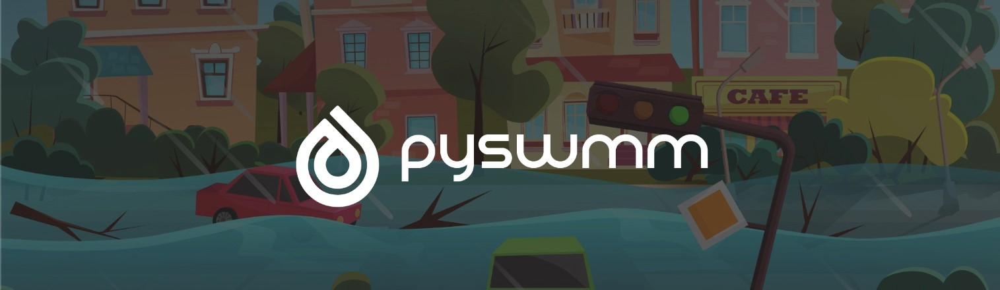

.. use raw html to hide the doc title show it is shows up in browser tab but not on page 
.. https://github.com/sphinx-doc/sphinx/issues/8356#issuecomment-1201029122
.. raw:: html

   

PySWMM documentation
=====================

.. raw:: html

   

**Date**: |today| **Version**: |version|

|gh actions| |docs| |license| |pypi version| |downloads| |cite|

-------------------

More information about pyswmm can be found at the `official pyswmm website`_.

.. panels::
    :container: container pb-4
    :card: + intro-card text-center
    :column: col-lg-6 col-md-6 col-sm-6 col-xs-12 p-2

    ---
    :img-top: _static/map.svg

    Overview
    ^^^^^^^^^^^^

    Learn about pyswmm's ambition!

    +++

    .. link-button:: overview
            :type: ref
            :text: Overview!
            :classes: btn-block btn-secondary stretched-link

    ---
    :img-top: _static/power.svg

    Quick Start
    ^^^^^^^^^^

    The quick start section provides sample code snippets for various use cases of pyswmm.
    This is the perfect place to jump-start your own project with pyswmm.

    +++

    .. link-button:: tutorial
            :type: ref
            :text: Tutorials!
            :classes: btn-block btn-secondary stretched-link

    ---
    :img-top: _static/book.svg

    API reference
    ^^^^^^^^^^^^^

    The API reference provides a catalogue of all docstrings written in pyswmm.
    It lays out the modules, functions, and classes provided in pyswmm like and encyclopedia.

    +++

    .. link-button:: reference/index
            :type: ref
            :text: API Reference!
            :classes: btn-block btn-secondary stretched-link

    ---
    :img-top: _static/coffee.svg

    Video Tutorials
    ^^^^^^^^^^^^^^^^

    The pyswmm development team is putting together a video 
    tutorial series the covers the various use cases of pyswmm.

    +++

    .. link-button:: https://www.pyswmm.org/tutorial
            :text: Video Tutorials!
            :classes: btn-block btn-secondary stretched-link

.. toctree::
   :maxdepth: 2
   :hidden:

   overview
   install
   quickstart
   reference/index
   Examples <https://www.pyswmm.org/examples>
   authors
   cite

.. only:: html

.. |gh actions| image:: https://github.com/OpenWaterAnalytics/pyswmm/actions/workflows/python-package.yml/badge.svg?branch=master
   :target: https://github.com/OpenWaterAnalytics/pyswmm/actions/workflows/python-package.yml
   :alt: GitHub Actions Build Status
.. |downloads| image:: https://img.shields.io/badge/dynamic/json.svg?label=Downloads&url=https%3A%2F%2Fpypistats.org%2Fapi%2Fpackages%2Fpyswmm%2Frecent&query=%24.data.last_month&colorB=green&suffix=%20last%20month
   :target: https://pypi.python.org/pypi/pyswmm/
   :alt: PyPI Monthly Downloads
.. |license| image:: https://img.shields.io/pypi/l/pyswmm.svg
   :target: LICENSE.txt
   :alt: License
.. |pypi version| image:: https://img.shields.io/pypi/v/pyswmm.svg
   :target: https://pypi.python.org/pypi/pyswmm/
   :alt: Latest PyPI version
.. |docs| image:: https://readthedocs.org/projects/pyswmm/badge/?version=latest
   :target: http://pyswmm.readthedocs.io/en/latest/?badge=latest
   :alt: Documentation Status
.. |cite| image:: https://joss.theoj.org/papers/10.21105/joss.02292/status.svg
   :target: https://doi.org/10.21105/joss.02292
   :alt: Cite our Paper
.. _official pyswmm website: https://www.pyswmm.org